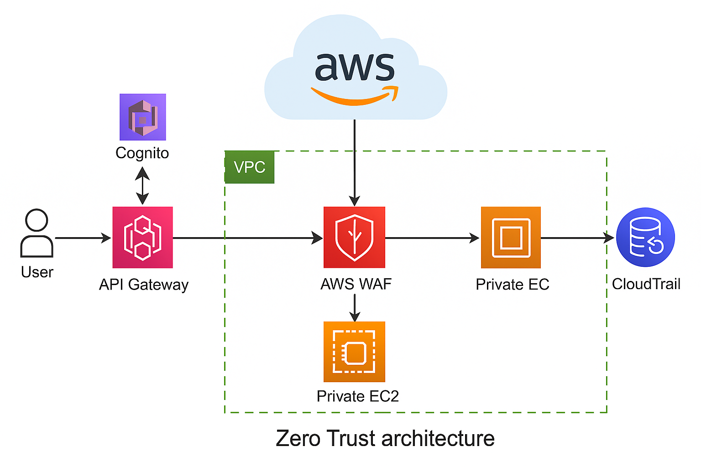
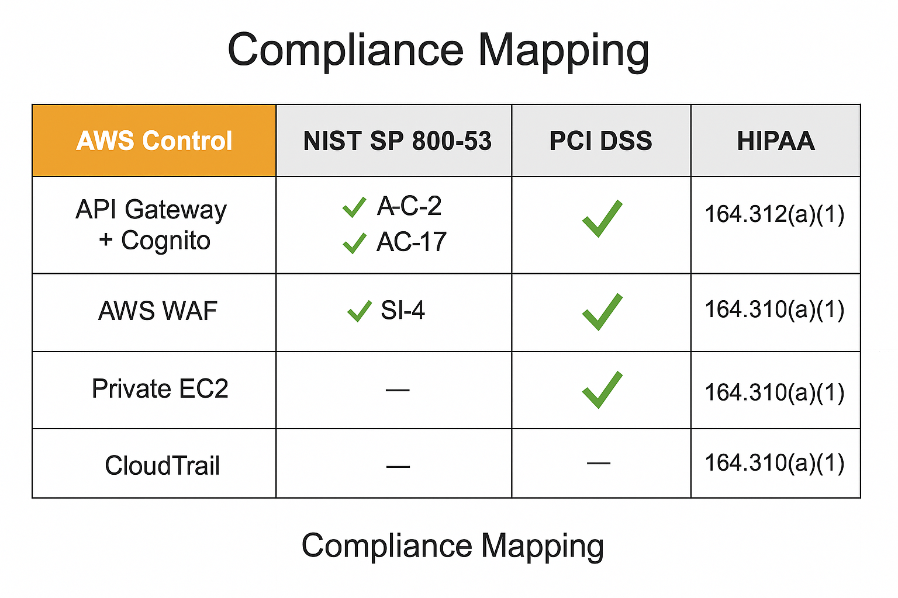

# AWS Zero Trust PoC – API Gateway, Cognito, WAF, Private EC2, and CloudTrail

This proof of concept demonstrates how to apply Zero Trust principles to a simple web/API workload on AWS using fully managed services:

- **API Gateway** for edge-facing API termination
- **Cognito** for user authentication and token issuance
- **AWS WAF** for request inspection and OWASP-style protections
- **Private EC2** instances in a VPC with no direct internet exposure
- **CloudTrail** and other logs to provide end-to-end auditability

The PoC focuses on **identity-centric access**, **segmentation**, and **observability** rather than “trusting” a network zone or VPN.

---

## Architecture Overview

**Flow:**

1. A **user** calls the public **API Gateway** endpoint.
2. API Gateway integrates with **Amazon Cognito**, which authenticates the user and issues OIDC/JWT tokens.
3. Authenticated requests are forwarded through **AWS WAF**, which applies managed rules (e.g., SQLi/XSS detection, rate limiting).
4. Approved traffic is routed into a **VPC**, reaching **private EC2 instances** that host the application.  
   - EC2 instances live in private subnets with no public IPs.
5. **CloudTrail** records control-plane operations and, together with other logs, provides a complete audit trail of activity across the environment.

This design ensures that **no direct internet access** exists to the EC2 layer; all access must traverse identity checks and policy enforcement points.

---

## Zero Trust in This PoC

This PoC applies Zero Trust principles in the following ways:

- **Identity before access** – API Gateway and Cognito enforce that all requests are authenticated; there are no anonymous API calls.
- **No implicit trust in the network** – the application tier is private; being “inside the VPC” does not automatically grant access.
- **Least privilege and segmentation** – security groups restrict traffic to only what’s required between API Gateway/WAF and the EC2 instances.
- **Continuous verification** – CloudTrail and other logging sources allow detection of configuration changes and suspicious behavior.
- **Central policy enforcement** – WAF and API Gateway act as central enforcement points for input validation and rate control.

---

## Compliance Mapping (High Level)

This PoC is mapped to several control frameworks to show how cloud-native Zero Trust building blocks align with compliance requirements.

- **NIST SP 800-53** – AC-2, AC-17 for access control; SI-4 for monitoring.
- **PCI DSS** – Requirements around network segmentation, access control, and logging.
- **HIPAA** – 164.31x(a)(1) safeguards related to access, audit, and integrity.

`compliance_mapping.md` contains the detailed mappings.

---

## Repository Layout

Zero-Trust-PoC/
├── README.md
├── project_summary.md
├── security_requirements.md
├── risks_and_mitigations.md
├── technologies.md
├── compliance_mapping.md
├── lessonslearned.md
├── A_2D_digital_diagram_illustrates_a_Zero_Trust_arch.png
├── A_compliance_mapping_chart_in_digital_graphic_form.png
└── terraform/
    ├── main.tf
    ├── vpc.tf
    ├── subnet.tf
    ├── igw.tf
    ├── route_table.tf
    ├── variables.tf
    ├── outputs.tf
    └── terraform.tfvars.example

Infrastructure-as-Code Note

Portions of this PoC were built using Terraform to provision the VPC, subnets,
route tables, and private EC2 instances. While the Terraform files are not
included in this repository, the project demonstrated:

- Network provisioning via IaC
- Segmentation using private subnets
- Repeatable deployment patterns
- Use of variables, outputs, and modular structure

These Terraform components were primarily used to support the Zero Trust testing
environment and validate the architecture described in this documentation.

